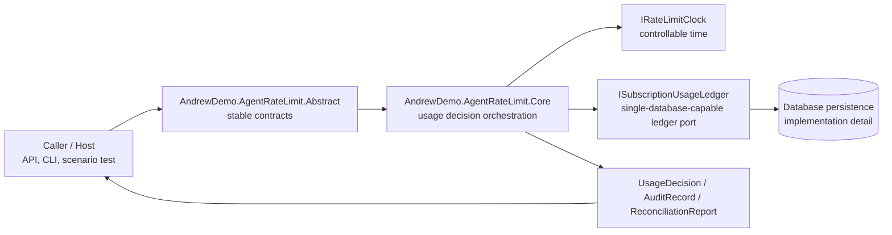
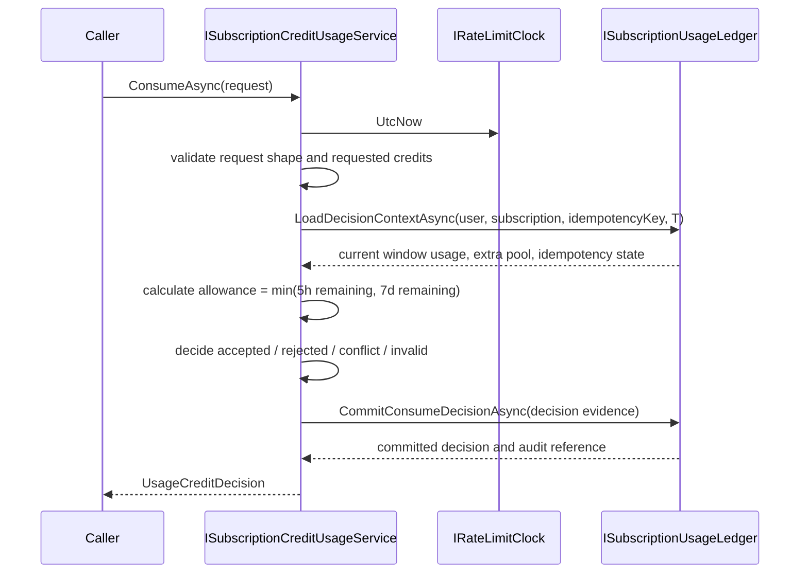

# Subscription Credit `.Abstract` Design

> 狀態：draft-for-review  
> 日期：2026-07-01  
> 範圍：依照 `Subscription Credit Rate Limit V1` 規格，提出 `AndrewDemo.AgentRateLimit.Abstract` 的 contract 設計。本文不定義 database schema、transaction strategy、API route、controller 或 Core 演算法。

## 1. Design Intent

這個 `.Abstract` 的目標不是先做完整 production billing system，而是固定「credit rate limit」在 Core、Host、測試與未來 storage adapter 之間不可漂移的語言。

穩定 contract 句子：

> Given a subscription usage request, controllable decision time, and persisted subscription usage evidence, the system returns a deterministic usage decision and auditable credit balance result without over-consuming the 5h window, 7d window, or extra pool.

第一版要保護的 correctness：

- `credit` 是唯一用量單位，帳務結果只能用整數 credit 表達。
- 5h 與 7d rolling window 同時限制 subscription allowance。
- extra pool 只在 window allowance 不足時補足，且不可變成負數。
- idempotency replay 不得二次扣款；payload mismatch 必須是 conflict。
- preview 不得改變 usage total、window usage、extra pool balance 或 reconciliation result。
- accepted、rejected、invalid、conflict、extra pool change、manual correction 都必須可回溯。
- 同一 subscription 的並發 consume 結果必須等價於某個明確順序。

## 2. Boundary

`AndrewDemo.AgentRateLimit.Abstract` 只放三類 contract：

1. Public use-case contracts：consume、preview、status、audit、reconciliation、extra pool adjustment。
2. Stable result models：usage decision、window status、audit record、reconciliation report。
3. Core-facing ports：clock 與 persistence capability 的語意邊界，不指定實作方式。

不放入 `.Abstract`：

- HTTP route、controller、SDK client naming。
- database table、index、lock、transaction 實作。
- queue/cache/message broker requirement。
- provider adapter protocol。
- 自動 plan upgrade、payment、invoice、refund。

## 3. Proposed Project Shape

```text
src/AndrewDemo.AgentRateLimit.Abstract/
├── Credits/
│   ├── CreditAmount
│   ├── CreditDelta
│   └── RequestedCreditsInput
├── Usage/
│   ├── ISubscriptionCreditUsageService
│   ├── UsageCreditRequest
│   ├── UsageCreditDecision
│   ├── UsageDecisionResult
│   ├── UsageRejectionReason
│   ├── UsageInvalidReason
│   └── UsageConflictReason
├── Status/
│   ├── ISubscriptionUsageStatusReader
│   ├── SubscriptionUsageStatus
│   ├── UsageWindowStatus
│   └── UsageWindowKind
├── Audit/
│   ├── IUsageAuditReader
│   ├── UsageAuditQuery
│   ├── UsageAuditRecord
│   └── UsageAuditRecordKind
├── Reconciliation/
│   ├── IUsageReconciliationExporter
│   ├── ReconciliationQuery
│   └── ReconciliationReport
├── ExtraPool/
│   ├── IExtraPoolAdjustmentService
│   ├── ExtraPoolAdjustmentRequest
│   └── ExtraPoolAdjustmentResult
└── Runtime/
    ├── IRateLimitClock
    └── ISubscriptionUsageLedger
```

`Runtime/ISubscriptionUsageLedger` 是 Core-facing port。它只能描述需要被保證的 ledger capability，例如 atomic decision commit、idempotency lookup、audit append；不可洩漏 database schema 或 locking method。

## 4. Use-Case Interfaces

### `ISubscriptionCreditUsageService`

```csharp
public interface ISubscriptionCreditUsageService
{
    ValueTask<UsageCreditDecision> ConsumeAsync(
        UsageCreditRequest request,
        CancellationToken cancellationToken);

    ValueTask<UsageCreditDecision> PreviewAsync(
        UsageCreditRequest request,
        CancellationToken cancellationToken);
}
```

Contract rules：

- `ConsumeAsync` 可以產生帳務變動與 audit record。
- `PreviewAsync` 必須回傳與 consume 同形狀的 decision，但不得產生扣款、window usage、extra pool consumption 或 reconciliation effect。
- 兩者都使用 `IRateLimitClock.UtcNow` 作為 decision time；外部 request 不可自行指定 window decision time。

### `ISubscriptionUsageStatusReader`

```csharp
public interface ISubscriptionUsageStatusReader
{
    ValueTask<SubscriptionUsageStatus> GetStatusAsync(
        SubscriptionUsageStatusQuery query,
        CancellationToken cancellationToken);
}
```

狀態查詢必須回傳 5h、7d 與 extra pool 的目前狀態。`next reset time` 只在對應 window 有 used credits 時存在。

### `IUsageAuditReader`

```csharp
public interface IUsageAuditReader
{
    ValueTask<UsageAuditPage> QueryAsync(
        UsageAuditQuery query,
        CancellationToken cancellationToken);
}
```

Audit 是正式 evidence，不是 debug log。accepted、rejected、invalid、conflict、extra pool change、manual correction 都要能以 `UsageAuditRecordKind` 區分。

### `IUsageReconciliationExporter`

```csharp
public interface IUsageReconciliationExporter
{
    ValueTask<ReconciliationReport> ExportAsync(
        ReconciliationQuery query,
        CancellationToken cancellationToken);
}
```

Reconciliation report 必須能重建指定期間內每個 subscription 的 accepted credits、rejected credits、subscription allowance covered credits、extra pool beginning/added/consumed/adjusted/ending balance，以及 conflict、invalid、manual correction counts。

### `IExtraPoolAdjustmentService`

```csharp
public interface IExtraPoolAdjustmentService
{
    ValueTask<ExtraPoolAdjustmentResult> AdjustAsync(
        ExtraPoolAdjustmentRequest request,
        CancellationToken cancellationToken);
}
```

Adjustment 必須留下 audit record。若 adjustment 會讓 extra pool 變成負數，應回傳 `invalid` 或專屬 failure result；不可讓 balance 變負。

## 5. Core Models

### Identity

建議使用 small value object，避免到處傳裸字串：

```csharp
public readonly record struct UserId(string Value);
public readonly record struct SubscriptionId(string Value);
public readonly record struct IdempotencyKey(string Value);
public readonly record struct CorrelationId(string Value);
public readonly record struct AuditReference(string Value);
public readonly record struct ActorId(string Value);
```

`UserId`、`SubscriptionId`、`IdempotencyKey` 的 missing validation 必須能回到 `UsageInvalidReason`，因此 request boundary 不能在 host deserialization 階段直接丟掉 invalid case。

### Credit Types

```csharp
public readonly record struct CreditAmount(int Value);
public readonly record struct CreditDelta(int Value);

public sealed record RequestedCreditsInput(
    string RawValue);
```

設計理由：

- `CreditAmount` 只代表已通過驗證的非負整數 credit。
- `CreditDelta` 允許 manual adjustment 使用正負整數，但 commit 後 extra pool 不可為負。
- `RequestedCreditsInput` 保留外部輸入，讓 fractional、zero、negative、empty 都能被轉成 `invalid` decision，而不是被 host 提前吞掉。
- 所有正式 decision、status、audit、report 的 credit 數字仍只用整數 `CreditAmount` / `CreditDelta` 表達。

### Usage Request

```csharp
public sealed record UsageCreditRequest(
    UserId? UserId,
    SubscriptionId? SubscriptionId,
    RequestedCreditsInput RequestedCredits,
    IdempotencyKey? IdempotencyKey,
    CorrelationId CorrelationId,
    string Source);
```

`Source` 是 audit/reconciliation 用的外部來源，例如 CLI、API、scenario runner。它不影響 admission result。

### Usage Decision

```csharp
public sealed record UsageCreditDecision(
    UsageDecisionResult Result,
    CreditAmount? RequestedCredits,
    CreditAmount CreditsCoveredBySubscriptionAllowance,
    CreditAmount CreditsCoveredByExtraPool,
    UsageWindowBalance FiveHourWindowAfterDecision,
    UsageWindowBalance SevenDayWindowAfterDecision,
    CreditAmount ExtraPoolRemainingAfterDecision,
    UsageRejectionReason? RejectionReason,
    UsageInvalidReason? InvalidReason,
    UsageConflictReason? ConflictReason,
    AuditReference? AuditReference,
    DateTimeOffset DecisionTimeUtc,
    bool IsPreview);
```

Notes：

- `RequestedCredits` 為 nullable，是為了處理 `credits-not-integer` 這類 invalid request；不可把 `1.5` 包裝成正式 credit 數字。
- `CreditsCoveredBySubscriptionAllowance` 與 `CreditsCoveredByExtraPool` 在 non-accepted decision 中應為 0。
- `AuditReference` 對 consume 的 accepted/rejected/invalid/conflict 應存在；preview 可選擇產生查詢紀錄，但不得被 reconciliation 視為扣款。

### Window Balance

```csharp
public sealed record UsageWindowBalance(
    UsageWindowKind Kind,
    CreditAmount Limit,
    CreditAmount Used,
    CreditAmount Remaining,
    DateTimeOffset? NextResetTimeUtc);

public enum UsageWindowKind
{
    FiveHours,
    SevenDays
}
```

Window inclusion rule 必須維持 spec 的邊界：

- `T - 5h < usage time <= T`
- `T - 7d < usage time <= T`

因此 exactly 5h old 與 exactly 7d old 的 accepted usage 都不再計入 used credits。

## 6. Decision Enums

Code enum 使用 PascalCase，對外 serialization 使用 spec 的 lower-kebab value。

```text
UsageDecisionResult
- Accepted -> "accepted"
- Rejected -> "rejected"
- Conflict -> "conflict"
- Invalid -> "invalid"

UsageRejectionReason
- InsufficientCredits -> "insufficient-credits"
- SubscriptionNotFound -> "subscription-not-found"
- SubscriptionDisabled -> "subscription-disabled"
- UserSubscriptionMismatch -> "user-subscription-mismatch"

UsageInvalidReason
- CreditsNotInteger -> "credits-not-integer"
- CreditsNotPositive -> "credits-not-positive"
- MissingUserId -> "missing-user-id"
- MissingSubscriptionId -> "missing-subscription-id"
- MissingIdempotencyKey -> "missing-idempotency-key"

UsageConflictReason
- IdempotencyKeyPayloadMismatch -> "idempotency-key-payload-mismatch"
```

Serialization mapping 建議放在 Core 或 Host 的 adapter helper，但 enum name 與 wire value 對應表應屬於 `.Abstract` contract 文件。

## 7. Ledger Port Semantics

`ISubscriptionUsageLedger` 不應暴露資料表。它要表達 Core 需要的 consistency capability：

```csharp
public interface ISubscriptionUsageLedger
{
    ValueTask<UsageDecisionContext> LoadDecisionContextAsync(
        UsageDecisionContextQuery query,
        CancellationToken cancellationToken);

    ValueTask<CommittedUsageDecision> CommitConsumeDecisionAsync(
        ConsumeDecisionCommit command,
        CancellationToken cancellationToken);

    ValueTask<AuditReference> AppendAuditRecordAsync(
        UsageAuditRecord record,
        CancellationToken cancellationToken);
}
```

必要語意：

- 同一 subscription 的 `CommitConsumeDecisionAsync` 結果必須等價於 serial order。
- 如果 idempotency key 已存在且 payload fingerprint 相同，必須回傳原 decision。
- 如果 idempotency key 已存在但 payload fingerprint 不同，必須回傳 conflict 並 append conflict audit。
- accepted commit 必須同時保存 usage evidence、window-affecting usage、extra pool consumption 與 audit reference。
- rejected、invalid、conflict commit 不可改變 usage total 或 extra pool balance，但必須可 audit。

這些是 contract 語意，不是要求一定使用 transaction、lock 或某種 database primitive。

## 8. Class Diagram

```mermaid
classDiagram
    class ISubscriptionCreditUsageService {
        +ConsumeAsync(UsageCreditRequest) UsageCreditDecision
        +PreviewAsync(UsageCreditRequest) UsageCreditDecision
    }

    class ISubscriptionUsageStatusReader {
        +GetStatusAsync(SubscriptionUsageStatusQuery) SubscriptionUsageStatus
    }

    class IUsageAuditReader {
        +QueryAsync(UsageAuditQuery) UsageAuditPage
    }

    class IUsageReconciliationExporter {
        +ExportAsync(ReconciliationQuery) ReconciliationReport
    }

    class IExtraPoolAdjustmentService {
        +AdjustAsync(ExtraPoolAdjustmentRequest) ExtraPoolAdjustmentResult
    }

    class UsageCreditRequest {
        +UserId? UserId
        +SubscriptionId? SubscriptionId
        +RequestedCreditsInput RequestedCredits
        +IdempotencyKey? IdempotencyKey
        +CorrelationId CorrelationId
        +string Source
    }

    class UsageCreditDecision {
        +UsageDecisionResult Result
        +CreditAmount? RequestedCredits
        +CreditAmount CreditsCoveredBySubscriptionAllowance
        +CreditAmount CreditsCoveredByExtraPool
        +UsageWindowBalance FiveHourWindowAfterDecision
        +UsageWindowBalance SevenDayWindowAfterDecision
        +CreditAmount ExtraPoolRemainingAfterDecision
        +AuditReference? AuditReference
        +DateTimeOffset DecisionTimeUtc
        +bool IsPreview
    }

    class ISubscriptionUsageLedger {
        +LoadDecisionContextAsync(UsageDecisionContextQuery) UsageDecisionContext
        +CommitConsumeDecisionAsync(ConsumeDecisionCommit) CommittedUsageDecision
        +AppendAuditRecordAsync(UsageAuditRecord) AuditReference
    }

    ISubscriptionCreditUsageService --> UsageCreditRequest
    ISubscriptionCreditUsageService --> UsageCreditDecision
    ISubscriptionCreditUsageService --> ISubscriptionUsageLedger
    ISubscriptionUsageStatusReader --> ISubscriptionUsageLedger
    IUsageAuditReader --> UsageAuditRecord
    IUsageReconciliationExporter --> ReconciliationReport
    IExtraPoolAdjustmentService --> ISubscriptionUsageLedger
```



## 9. C4 Boundary



Boundary reading：

- Host 可以替換，但不得改 decision 語意。
- Core 可以替換演算法，但必須符合 `.Abstract` 與 `spec/testcases`。
- Ledger implementation 可以用 SQLite 或其他 database，但不得改 externally observable result。

## 10. Consume Sequence



Preview sequence 相同到 calculate decision 為止，但不得呼叫 `CommitConsumeDecisionAsync` 建立扣款結果；若需要 preview audit，只能 append non-reconciliation query record。

## 11. Testcase Mapping

| Contract area | Primary types | Covered testcases |
|---|---|---|
| Credit validation | `RequestedCreditsInput`, `CreditAmount`, `UsageInvalidReason` | TC-CREDIT-001..007 |
| Window decision | `UsageWindowBalance`, `UsageCreditDecision` | TC-WINDOW-001..007 |
| Extra pool | `CreditDelta`, `ExtraPoolAdjustmentRequest`, `ExtraPoolAdjustmentResult` | TC-EXTRA-001..003 |
| Preview | `PreviewAsync`, `UsageCreditDecision.IsPreview` | TC-PREVIEW-001..002 |
| Idempotency | `IdempotencyKey`, `UsageConflictReason`, `ISubscriptionUsageLedger` semantics | TC-IDEMP-001..002 |
| Isolation | `UserId`, `SubscriptionId`, decision context query | TC-ISOLATION-001..005 |
| Consistency and persistence | `CommitConsumeDecisionAsync`, audit reference | TC-CONSISTENCY-001..003 |
| Audit and reconciliation | `UsageAuditRecord`, `ReconciliationReport` | TC-AUDIT-001..004 |
| Status output | `SubscriptionUsageStatus`, `UsageWindowBalance` | TC-STATUS-001..002 |

## 12. Open Review Points

1. `RequestedCreditsInput` 是否接受 `string RawValue`：這能保留 fractional input 並回傳 `credits-not-integer`，但 host adapter 需要負責把 JSON number 轉成不失真的 raw value。
2. Preview 是否一定要留下 audit record：V1 spec 說可以留下查詢紀錄，但不得成為帳務扣款紀錄。建議第一個實作切片先不要求 preview audit，只要求 usage status 不變。
3. `ISubscriptionUsageLedger` 是否現在就進 `.Abstract`：若 Phase 1 只做 in-memory POC，可先保留 port；若要直接進 SQLite，這個 port 會成為 Core 與 persistence 的必要 boundary。
4. Manual correction 的 result shape：V1 testcases 要求 audit 與 reconciliation 可見，但尚未定義 correction 對 window usage 的精確規則。建議先把 correction 定義為 audit/report evidence，不回頭改寫原始 usage record。
