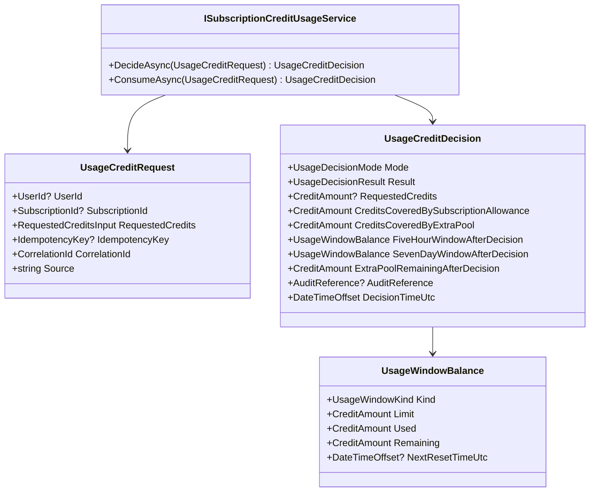
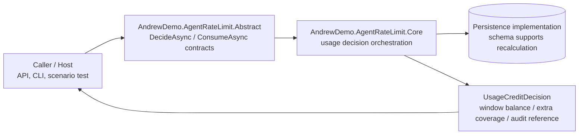
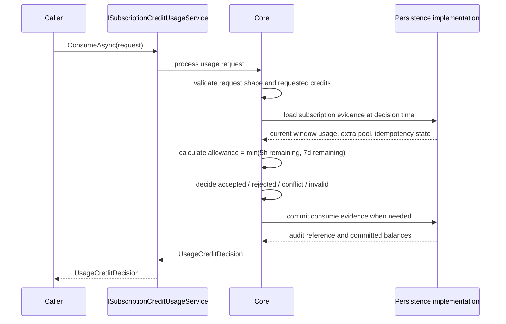

# Subscription Credit `.Abstract` Design

> 狀態：draft-for-review  
> 日期：2026-07-01  
> 範圍：依照 `Subscription Credit Rate Limit V1` 規格，提出 `AndrewDemo.AgentRateLimit.Abstract` 的最小 contract 設計。本文不定義 database schema、transaction strategy、API route、controller、reconciliation exporter、extra pool adjustment service 或 Core 演算法。

## 1. Design Intent

這個 `.Abstract` 的目標是固定 credit rate limit 在「正常服務處理」時不可漂移的輸入與輸出：先判定，再消費。它不承擔後台報表、帳務調整、schema recalculation 或資料修復流程的 service surface。

穩定 contract 句子：

> Given a subscription usage request and a decision time controlled by the runtime, the service can deterministically decide whether the request is usable, and can consume credits exactly once when the request is accepted.

第一版要保護的 correctness：

- `credit` 是唯一用量單位，正式 decision 裡只能用整數 credit 表達。
- 5h 與 7d rolling window 同時限制 subscription allowance。
- extra pool 只在 window allowance 不足時補足，且 consume 後不可變成負數。
- idempotency replay 不得二次扣款；payload mismatch 必須是 conflict。
- decide-only path 不得改變 usage total、window usage、extra pool balance 或 reconciliation result。
- consume path 必須回傳可回溯的 audit reference。
- 同一 subscription 的並發 consume 結果必須等價於某個明確順序。

## 2. Boundary

`AndrewDemo.AgentRateLimit.Abstract` 只放兩類 contract：

1. Normal service processing contract：`DecideAsync` 與 `ConsumeAsync`。
2. Stable service result models：usage request、usage decision、window balance、credit coverage、decision reasons、audit reference。

不放入 `.Abstract`：

- HTTP route、controller、SDK client naming。
- database table、index、lock、transaction 實作。
- queue/cache/message broker requirement。
- provider adapter protocol。
- reconciliation export 介面。
- extra pool adjustment 介面。
- audit trail query 介面。
- usage status query 介面。
- manual correction service。
- schema recalculation API。
- 自動 plan upgrade、payment、invoice、refund。

Schema 設計仍然必須支援重新計算，但那是 storage/evidence design 的責任：implementation 必須保存足夠的 immutable usage evidence、extra pool movement、idempotency fingerprint 與 audit reference，讓未來可以重建 window usage、extra pool balance、audit trail 與 reconciliation report。這個能力不需要在 `.Abstract` 暴露成 `IUsageReconciliationExporter` 或其他查詢介面。

## 3. Proposed Project Shape

```text
src/AndrewDemo.AgentRateLimit.Abstract/
├── Credits/
│   ├── CreditAmount
│   ├── CreditDelta
│   └── RequestedCreditsInput
└── Usage/
    ├── ISubscriptionCreditUsageService
    ├── UsageCreditRequest
    ├── UsageCreditDecision
    ├── UsageDecisionMode
    ├── UsageDecisionResult
    ├── UsageRejectionReason
    ├── UsageInvalidReason
    ├── UsageConflictReason
    ├── UsageWindowBalance
    ├── UsageWindowKind
    └── UsageIdentity
```

設計刻意不建立 `Reconciliation/`、`ExtraPool/`、`Status/` 或 `Audit/` service folders。decision response 可以帶 audit reference 與 window balance，但 `.Abstract` 不提供讀取、匯出或調整這些資料的介面。

## 4. Service Interface

### `ISubscriptionCreditUsageService`

```csharp
public interface ISubscriptionCreditUsageService
{
    ValueTask<UsageCreditDecision> DecideAsync(
        UsageCreditRequest request,
        CancellationToken cancellationToken);

    ValueTask<UsageCreditDecision> ConsumeAsync(
        UsageCreditRequest request,
        CancellationToken cancellationToken);
}
```

Contract rules：

- `DecideAsync` 是 V1 `Preview Usage` 在 `.Abstract` 的名稱。它必須回傳若現在 consume 會得到的 decision shape，但不得建立扣款、window usage、extra pool consumption 或 reconciliation effect。
- `ConsumeAsync` 是唯一會消費 credit 的正常服務處理入口。若 result 是 `Accepted`，它必須使 usage evidence 與 extra pool consumption 可被 persistence 層回溯。
- `ConsumeAsync` 對 `Rejected`、`Invalid`、`Conflict` 不可改變 usage total 或 extra pool balance，但 implementation 仍應保存足夠 evidence 供 audit/recalculation 使用。
- decision time 由 runtime 控制，不由 external request 指定；測試仍必須能以 controllable time 驗證 rolling window。

## 5. Core Contract Models

### Identity

建議使用 small value object，避免到處傳裸字串：

```csharp
public readonly record struct UserId(string Value);
public readonly record struct SubscriptionId(string Value);
public readonly record struct IdempotencyKey(string Value);
public readonly record struct CorrelationId(string Value);
public readonly record struct AuditReference(string Value);
```

`UserId`、`SubscriptionId`、`IdempotencyKey` 的 missing validation 必須能回到 `UsageInvalidReason`，因此 request boundary 不能在 host deserialization 階段直接丟掉 invalid case。

### Credit Types

```csharp
public readonly record struct CreditAmount(int Value);
public readonly record struct CreditDelta(int Value);

public sealed record RequestedCreditsInput(
    string RawValue);
```

設計理由：

- `CreditAmount` 只代表已通過驗證的非負整數 credit。
- `CreditDelta` 可以留給 implementation/schema evidence 使用，例如 extra pool movement 或 manual correction；它不是 `.Abstract` service interface。
- `RequestedCreditsInput` 保留外部輸入，讓 fractional、zero、negative、empty 都能被轉成 `invalid` decision，而不是被 host 提前吞掉。
- 所有正式 decision 裡的 credit 數字仍只用整數 `CreditAmount` / `CreditDelta` 表達。

### Usage Request

```csharp
public sealed record UsageCreditRequest(
    UserId? UserId,
    SubscriptionId? SubscriptionId,
    RequestedCreditsInput RequestedCredits,
    IdempotencyKey? IdempotencyKey,
    CorrelationId CorrelationId,
    string Source);
```

`Source` 是 audit/recalculation evidence 的來源描述，例如 API、CLI 或 scenario runner。它不影響 usage decision。

### Usage Decision

```csharp
public sealed record UsageCreditDecision(
    UsageDecisionMode Mode,
    UsageDecisionResult Result,
    CreditAmount? RequestedCredits,
    CreditAmount CreditsCoveredBySubscriptionAllowance,
    CreditAmount CreditsCoveredByExtraPool,
    UsageWindowBalance FiveHourWindowAfterDecision,
    UsageWindowBalance SevenDayWindowAfterDecision,
    CreditAmount ExtraPoolRemainingAfterDecision,
    UsageRejectionReason? RejectionReason,
    UsageInvalidReason? InvalidReason,
    UsageConflictReason? ConflictReason,
    AuditReference? AuditReference,
    DateTimeOffset DecisionTimeUtc);
```

Notes：

- `RequestedCredits` 為 nullable，是為了處理 `credits-not-integer` 這類 invalid request；不可把 `1.5` 包裝成正式 credit 數字。
- `CreditsCoveredBySubscriptionAllowance` 與 `CreditsCoveredByExtraPool` 在 non-accepted decision 中應為 0。
- `AuditReference` 對 `ConsumeAsync` 的 accepted/rejected/invalid/conflict 應存在；`DecideAsync` 不應產生帳務 audit reference。
- `Mode` 必須能區分 `DecideOnly` 與 `Consume`，避免 preview/decide 結果被誤視為已扣款結果。

### Window Balance

```csharp
public sealed record UsageWindowBalance(
    UsageWindowKind Kind,
    CreditAmount Limit,
    CreditAmount Used,
    CreditAmount Remaining,
    DateTimeOffset? NextResetTimeUtc);

public enum UsageWindowKind
{
    FiveHours,
    SevenDays
}
```

Window inclusion rule 必須維持 spec 的邊界：

- `T - 5h < usage time <= T`
- `T - 7d < usage time <= T`

因此 exactly 5h old 與 exactly 7d old 的 accepted usage 都不再計入 used credits。

## 6. Decision Enums

Code enum 使用 PascalCase，對外 serialization 使用 spec 的 lower-kebab value。

```text
UsageDecisionMode
- DecideOnly -> "decide-only"
- Consume -> "consume"

UsageDecisionResult
- Accepted -> "accepted"
- Rejected -> "rejected"
- Conflict -> "conflict"
- Invalid -> "invalid"

UsageRejectionReason
- InsufficientCredits -> "insufficient-credits"
- SubscriptionNotFound -> "subscription-not-found"
- SubscriptionDisabled -> "subscription-disabled"
- UserSubscriptionMismatch -> "user-subscription-mismatch"

UsageInvalidReason
- CreditsNotInteger -> "credits-not-integer"
- CreditsNotPositive -> "credits-not-positive"
- MissingUserId -> "missing-user-id"
- MissingSubscriptionId -> "missing-subscription-id"
- MissingIdempotencyKey -> "missing-idempotency-key"

UsageConflictReason
- IdempotencyKeyPayloadMismatch -> "idempotency-key-payload-mismatch"
```

Serialization mapping 可以由 Core 或 Host adapter 實作，但 enum name 與 wire value 對應表應屬於 `.Abstract` contract 文件。

## 7. Recalculation Evidence Guidance

這一節不是 `.Abstract` interface，只是限制後續 schema/core 設計不能破壞的 evidence shape。

後續 schema 必須能重新計算：

- 每個 subscription 在任一 decision time 的 5h used/remaining。
- 每個 subscription 在任一 decision time 的 7d used/remaining。
- extra pool beginning balance、added、consumed、adjusted、ending balance。
- accepted/rejected/invalid/conflict 的 request count 與 credit total。
- 同一 idempotency key 的 original payload fingerprint 與 original decision。
- manual correction 不覆蓋原始 usage record 的差異。

這些 evidence 可由 storage schema、Core repository port、migration 或 reporting layer 設計支援；不應讓 `.Abstract` 因此增加 `IUsageReconciliationExporter`、`IExtraPoolAdjustmentService` 或 audit query 介面。

## 8. Class Diagram



## 9. C4 Boundary



Boundary reading：

- Host 可以替換，但不得改 decision 語意。
- Core 可以替換演算法，但必須符合 `.Abstract` 與 `spec/testcases`。
- Persistence implementation 必須支援重新計算，但 schema 與 report/export service 不屬於 `.Abstract`。

## 10. Consume Sequence



`DecideAsync` 使用相同 decision rules，但不得 commit consume evidence，也不得改變 usage status、extra pool balance 或 reconciliation result。

## 11. Testcase Mapping

| Contract area | Primary types | Covered testcases |
|---|---|---|
| Credit validation | `RequestedCreditsInput`, `CreditAmount`, `UsageInvalidReason` | TC-CREDIT-001..007 |
| Window decision | `UsageWindowBalance`, `UsageCreditDecision` | TC-WINDOW-001..007 |
| Extra pool consumption result | `CreditsCoveredByExtraPool`, `ExtraPoolRemainingAfterDecision` | TC-EXTRA-001..002 |
| Decide-only behavior | `DecideAsync`, `UsageDecisionMode.DecideOnly` | TC-PREVIEW-001..002 |
| Idempotency | `IdempotencyKey`, `UsageConflictReason`, `AuditReference` | TC-IDEMP-001..002 |
| Isolation | `UserId`, `SubscriptionId`, rejection reasons | TC-ISOLATION-001..005 |
| Consistency and persistence | `ConsumeAsync`, `AuditReference`, recalculation evidence guidance | TC-CONSISTENCY-001..003 |
| Audit and reconciliation | Not an `.Abstract` interface; implementation/schema concern | TC-AUDIT-001..004 |
| Status output | Not an `.Abstract` interface; decision still returns after-decision balances | TC-STATUS-001..002 |

## 12. Open Review Points

1. `DecideAsync` 命名是否比 `PreviewAsync` 更貼近「判定」：目前建議用 `DecideAsync`，並在文件中說明它對應 V1 的 preview behavior。
2. `RequestedCreditsInput` 是否接受 `string RawValue`：這能保留 fractional input 並回傳 `credits-not-integer`，但 host adapter 需要負責把 JSON number 轉成不失真的 raw value。
3. Recalculation evidence 要放在哪份下一階段文件：建議另開 `docs/architecture/subscription-credit-schema-design.md`，專門處理 schema 如何支援 replay/recalculation，不污染 `.Abstract`。
4. Extra pool adjustment 與 manual correction：不進 `.Abstract`；後續若要實作，應由 admin/storage design 定義，不改正常服務處理 contract。
